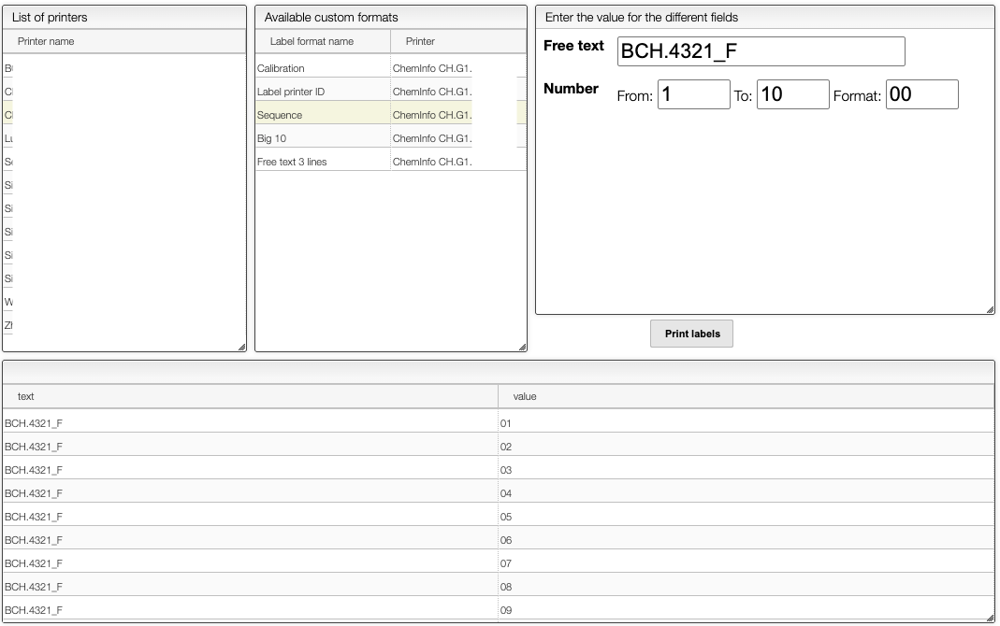

# Print custom labels

The tool allows the user to print custom labels of locations.

### 1. List of Printers (Left Panel)
- Displays all available printers connected to the system.
- Select your desired label printer from this list before printing.

### 2. Available Custom Formats (Middle Panel)
- Shows predefined label formats associated with specific printers.
- Select a format that matches the label type you want to print.
- Examples include:
  - **Calibration**
  - **Label printer ID**
  - **Sequence** (selected in the screenshot)
  - **Big 10**
  - **Free text 3 lines**

### 3. Label Input Configuration (Right Panel)
- Customize the content of your labels:
  - **Free text**: The constant part of the label (e.g., `BCH.4321_F`)
  - **Number range**:
    - **From**: Starting number (e.g., `1`)
    - **To**: Ending number (e.g., `10`)
    - **Format**: Number format (e.g., `00` $\to$ outputs `01`, `02`, ... `10`)
- Click the **Print labels** button to generate labels.

## Label Preview Table (Bottom Panel)

After selecting a printing format, a preview table shows:

| text        | value |
|-------------|-------|
| BCH.4321_F  | 01    |
| BCH.4321_F  | 02    |
| BCH.4321_F  | 03    |
| ...         | ...   |
| BCH.4321_F  | 10    |

This allows you to verify the output before physically printing.
