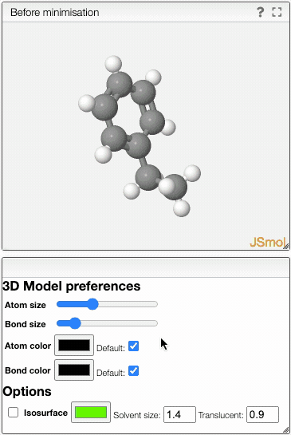

# Generate 3D models for molecules

## How to use it ?

- Draw a molecule
- Click on Generate conformers

You can modify the molecule to be visualized by using the panel on the left. If you wish to find out more about how to draw a molecule click on the  button.

:::note
The calculations are done in the browser and the molecule IS NOT sent to the server and it is not leaving your browser.
:::

:::info
This code uses [openchemlib-js](https://github.com/cheminfo/openchemlib-js), the javascript version of [openchemlib](https://github.com/Actelion/openchemlib).
:::

## Customize the model

You can manipulate the 3D model by adjusting several preferences.

