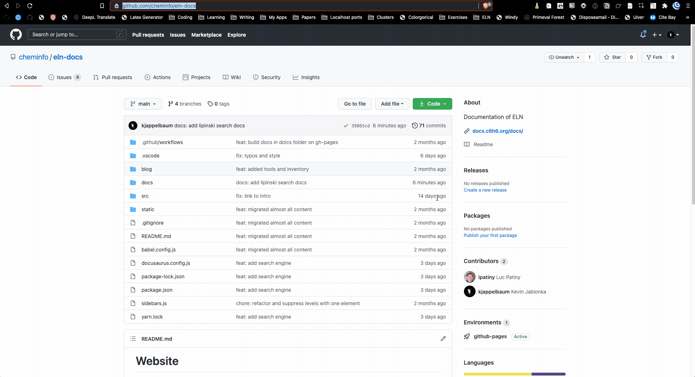

# Writing documentation

The documentation of the ELN is hosted on GitHub and the simplest way to correct or improve the text is to directly edit the file on [GitHub](https://github.com/cheminfo/eln-docs).

If you want to get involved more deeply in the update of the documentation it is better to have a local copy of the repository on your computer.

## Spellcheck 

We use a GitHub action that automatically checks the spelling in all Markdown files. 
Under the hood it uses [pyspelling](https://facelessuser.github.io/pyspelling/configuration/#spell-checker-options), which you can run with `pyspelling -c spellcheck.yaml`.
It might be that the dictionaries `pyspelling` uses do not know some words. Add them to `wordlist.txt` in this case.