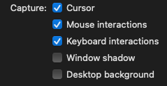

# Images and GIF

In order to insert an image or a GIF in Markdown, simply write the following code :

```md

```
It is better to create a folder when there are images or GIF, it is therefore easier to move all documents.

## Modify an image

To modify an image, we use [Inskape](https://inkscape.org/), a free and open source software. 

These are the steps to follow to modify an image :

>
1. Modify the image using Inskape
2. Select the image and go to `File` &rarr; `Document properties..`.
3. Hit the button `Resize page to drawing or selection`or simply use `Cmd + Shift + R`
4. Save the file as `.svg`, this allow the posibility to remodify the image later on.


# Record a GIF

To record a GIF we use [Gifox 2](https://gifox.io/) available on mac.

:::tip Gifox settings

Make sure that the following settings are enable/disable.



:::
