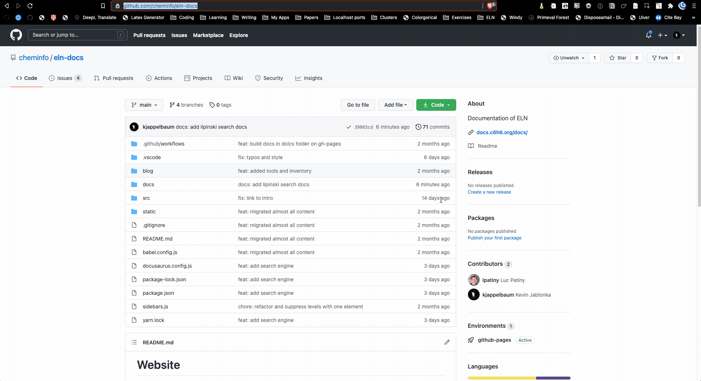

# Writing documentation

The documentation of the ELN is hosted on GitHub and the simplest way to correct or improve the text is to directly edit the file on [GitHub](https://github.com/cheminfo/eln-docs).



If you want to get involved more deeply in the update of the documentation it is better to have a local copy of the repository on your computer.

## Spellcheck 

We use a GitHub action that automatically checks the spelling in all Markdown files. 
Under the hood it uses [PySpelling](https://facelessuser.github.io/pyspelling/configuration/#spell-checker-options), which you can run with `pyspelling -c spellcheck.yaml`.
It might be that the dictionaries `PySpelling` uses do not know some words. Add them to `wordlist.txt` in this case.

## Includes

If you want to include the content of another file, you can do this in two ways. Either you include the total content of the page or a summary menu that open only when we click on it.

### How to import a page

In order to import a page, at the beginning of the markdown file you have to write :

```html
import Name from '<path_to_file>/README.md'
```

:::danger Name
The name that you use in the import command **have to start with a capital letter** !
:::

Then, in the script you can use this imported module using the following command :

```html
<Name/>
```

The included files have to be located in a folder in the following way : `/includes/<folder_name>/README.md`.
