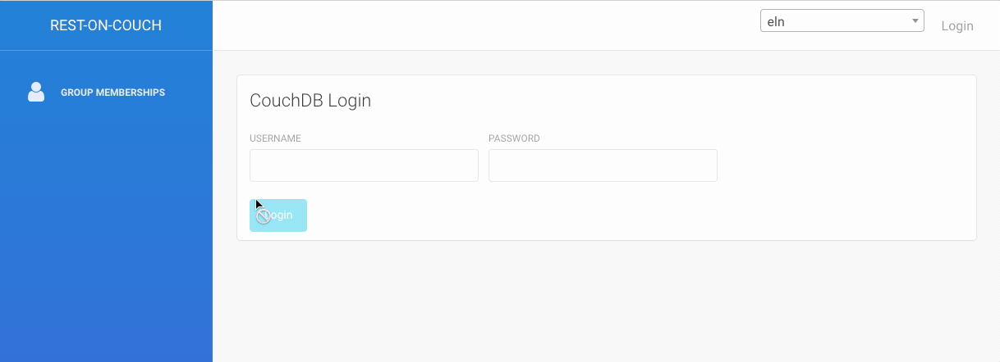

# Deploying the ELN

## System requirements

To host an instance of the ELN no special hardware is needed. In principle, an old computer with 8 GB of RAM and an old CPU can be used.
The system itself will not need a lot of space of the hard drive and the required hard drive space will depend on the amount of data you want to store (to get started, even 32 GB are enough to store >6,000 5 MB files, and most chemical files are smaller).

We recommend that you use CentOS (or AlmaLinux) or Ubuntu as operating system.

## Installing dependencies

### 1. Install docker and docker-compose and some dependencies

On Red Hat Linux/CentOS 8 you need to run the following commands:

```bash
dnf update -y
dnf install epel-release -y
dnf install git -y
```

Please check that the firewall accepts external connection on port 80 or 443. Adding those rules should be done BEFORE starting docker !

:::tip
If `firewalld` is active you may have to open ports. On CentOS:

```bash
firewall-cmd --permanent --zone=public --add-service=https
firewall-cmd --permanent --zone=public --add-service=http
firewall-cmd --reload
```

:::

Install `docker` and `docker-compose`. If you are using CentOS or Redhat please check the tip here after.

```bash
dnf config-manager --add-repo=https://download.docker.com/linux/centos/docker-ce.repo
dnf install docker-ce –allowerasing
curl -L "https://github.com/docker/compose/releases/download/1.27.4/docker-compose-$(uname -s)-$(uname -m)" -o /usr/local/bin/docker-compose
```

In Ubuntu you can use the apt package manager to install dependencies.

You can use [similar commands or installers](https://nodejs.org/en/download/) on other operating systems.

:::tip
If you are using AlmaLinux (a maintained alternative to CentOS that is 1:1 binary compatible with RHEL®) you should use `podman` and `podman-compose`.

```bash
dnf install podman dnsmasq podman-plugins python39 -y
pip3 install podman-compose
systemctl start podman
systemctl enable podman
```

and in `/root/.bashrc`

```
alias docker='podman'
alias docker-compose='podman-compose'
```

:::

### 2. Optional configurations

- [On CentOS/Red Hat Linux you might want to permanently disable SE Linux](https://www.rootusers.com/how-to-enable-or-disable-selinux-in-centos-rhel-7/)
- If you are behind a corporate proxy you can follow [the guide to configure Docker to use the proxy](https://docs.docker.com/engine/admin/systemd/#/http-proxy)

## Getting the ELN code and running it

### 1. Start docker daemon

```bash
systemctl start docker
systemctl enable docker
```

### 2. Clone this repo

We recommend that you run it from `/usr/local/docker`, but this is not crucial for this system.

```bash
mkdir /usr/local/docker
cd /usr/local/docker
curl -L https://github.com/cheminfo/roc-eln-docker/archive/master.tar.gz | tar xz
mv roc-eln-docker-master roc-eln-docker
cd roc-eln-docker
```

### 3. Edit configuration

1. `cp .env.example .env`
2. Adjust the options in `.env`. Mandatory configuration options have the value `REPLACEME`
3. Optional: edit `flavor-builder-config.json` to configure home page
4. If LDAP configuration is needed, edit `rest-on-couch/home/ldap.js`.

You might want to use the `nginx` proxy directly without additional Apache or Nginx server. In this case, you'll need to set `NGINX_PORT` to 80 (HTTP) or 443 (HTTPS), modify the docker compose to something like

```
services:
  nginx-proxy:
    image: docker.io/nginx:1.14-alpine
    ports:
      - "${NGINX_PORT}:80" # or  "${NGINX_PORT}:433"
```

:::important
The default `docker-compose.yml` configuration does not expose the nginx port to the world by specifying `127.0.0.1`. This should be removed if we want to allow direct connection to nginx.
:::

and the `nginx` configuration to read the SSL certificates in case you use SSL.

If you do not make these changes, you'll need to set up an Apache or Nginx server on our system. This is configuration is preferable in case you have more than one service running on your server.

Once you updated the configuration, you can run

```
docker-compose up -d
```

:::caution Don't use docker
You should not use the docker instruction because it is not aware of dependencies, and it could lead to unexpected results. Please always use docker-compose instead.

In order to check all the running docker images: `docker-compose ps`. To restart a specific image: `docker-compose restart rest-on-couch`
:::

## Testing locally

To test the installation locally (e.g., on your MacBook) you also only need to install `docker-compose`. You might use the following setting for some of the environment variables

```
# Local port from which the application will be served
NGINX_PORT=4444

# Access to CouchDB admin interface. This port shouldn't be accessible from everywhere
COUCHDB_PORT=4445

# Domain name(s) that the cookie will be bound to
# Example: server.example.com
REST_ON_COUCH_SESSION_DOMAIN=127.0.0.1

# Same as REST_ON_COUCH_SESSION_DOMAIN, only with http:// or https://
# Multiple origins can be specified, separated by a comma
# Example: https://server1.example.com,https://server2.example.com
REST_ON_COUCH_ORIGINS=http://127.0.0.1
```

## Setting up an Apache server

Under RedHat/CentOs run

```
yum install httpd -y
systemctl enable httpd
```

then, create `/etc/httpd/conf.d/eln.conf` with the following content

```
<VirtualHost *:80>
    ServerAdmin     a@b.com
    ServerName      eln.myinstitution.org

    SetEnvIf Origin "^(.*)$" AccessControlAllowOrigin=$0
    Header set Access-Control-Allow-Origin %{AccessControlAllowOrigin}e env=AccessControlAllowOrigin
    Header set Vary Origin
    Header set Access-Control-Expose-Headers "ETag, Content-Type, Access-Control-Allow-Headers, Authorization, X-Requested-With"

    AllowEncodedSlashes NoDecode
    ProxyPass / http://localhost:4444/ nocanon
    ProxyPassReverse / http://localhost:4444/
</VirtualHost>
```

In case you want to use SSL, you can listen on port 433 and add your SSL certificates. To check your configuration, you can use `apachectl configtest`

You can start the server with `systemctl start httpd`.

## Firewall/iptables

If you did not already install iptables, you can do it with

```
yum install iptables-services -y
systemctl start iptables
systemctl enable iptables
```

to allow HTTP on port 80 add the following rule to `/etc/sysconfig/iptables`

```
-A INPUT -p tcp --dport 80 -m state --state NEW,ESTABLISHED -j ACCEPT
```

:::tip
Note that docker will install new chains in iptables. This means you may not restart iptables once docker is started ! If you really have to restart iptables service then you will have also to restart docker and docker-compose.
:::

## Groups

Typically, you will want to set up groups in the database to easily manage access to documents. You can do so via the `roc/` endpoint of your deployment.
For this, log in as `admin@cheminfo.org` and select the "ELN" database.



In the "Groups" section you can then administer groups. To create a group, you only have to enter the name of the group.


Once you created a group, you can add users and owners by adding the usernames (email addresses) and specifying the rights (e.g., `read, write`)


## Creating user accounts

In case you do not use the LDAP or Google authentication, you will need to create user accounts. To do so, you can use the frontend at the `roc/` endpoint. If you want to create many users at once, you might want to use a script that inserts the documents into the `_users` database. In both approaches, you will set some initial password which users can change themselves at the `roc/` endpoint.


## User forgot password

## CouchDB authentication

If a user forgot a password, the admin can provide the users with a new password by updating the document of the user in the couchdb `_users` database (for example, this can conveniently be done from the Fauxton interface at the `_utils` endpoint of your database URL). By inserting the field `password` with a new password in the document, the password will be updated, and the user can change the password from the `roc/` endpoint.

## Google or LDAP authentication

In case the account uses Google or LDAP authentication you cannot help the user other than by referring to the password reset procedure of the authentication provider (LDAP, Google).
