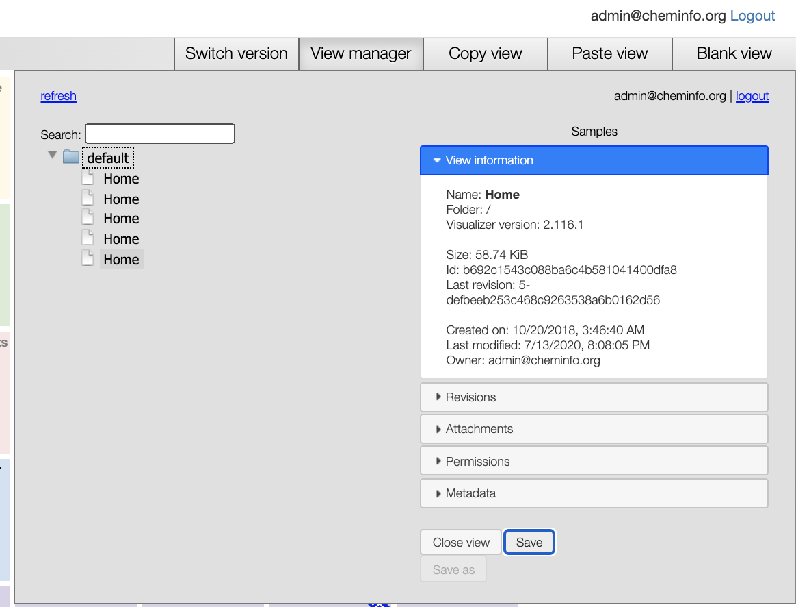
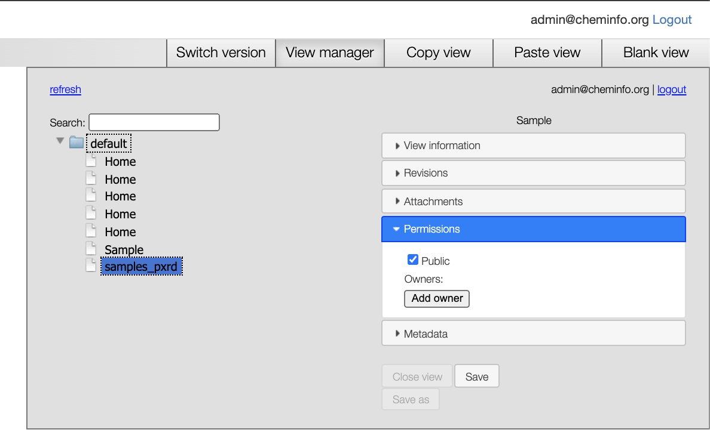
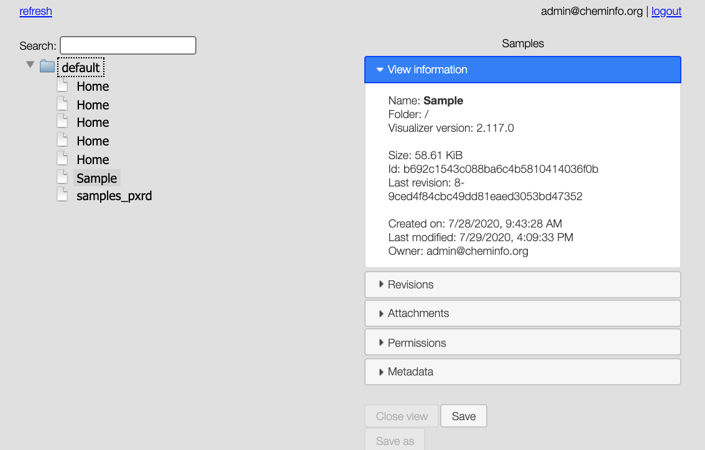

# Customizing the deployment

## Editing the home page

When going to your website: `http://localhost/on-tabs/` (after login using the credentials specified in the `docker-compose.yml` file you will be able to edit the home page view as well as to define custom local views.

You will see a view manager as shown below

which allows you toggle between revisions.

If you want to change for example the tiles that are shown on the home screen, you can right-click and then select `switch to layer/Links` where you will be able to delete, move and add tiles.

What you for example might want to do is to change the document to which the help button redirects to.
For this, you can go to the `on-tabs` website, right click on and select `Global preferences`, then under `Action Scripting` you can edit the `Action Help`

## Mofifying views

Views are `json` files for the [visualizer](https://github.com/NPellet/visualizer) for which [there is a tutorial on cheminfo.org](http://www.cheminfo.org/Tutorial/1._Introduction/1.1_Basic_example/index.html).

To develop your own views (or customize views as the one for the samples), you can use `https://my.cheminfo.org/`.

To use a view you saved locally using the `on-tabs` website (`http://localhost/on-tabs/`, e.g., paste a view developed on https://my.cheminfo.org/), the permissions need to be set to `public`.

Then, the `uuid` needs to be prefixed with `private/`. That is, for the example shown below, one would add `private/b692c1543c088ba6c4b5810414036f0b` as URL in the `links` view of the ELN.

.
