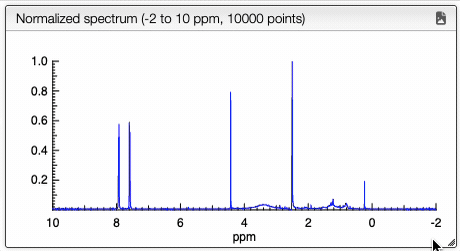

# Structure elucidation

# Visualization of normalized spectrum

After dropping a JCAMP-DX file, the system will automatically normalize the spectrum. Specifically, it selects the data points between -2 and 10 ppm and reduces the total number of points to 10,000.

The normalized spectrum, along with the molecular formula, is then sent to the server for structure elucidation. Note that the server does not have prior knowledge of the correct structure; it performs the analysis based solely on the provided data.

You can interactively explore the normalized spectrum using several intuitive controls:

- Zoom in on specific regions by dragging or scrolling horizontally.
- Double-click to quickly reset the view to the full spectrum.
- Adjust the vertical scale with the mouse wheel for better visibility of signal intensity.

The animation below demonstrates these manipulation features:

