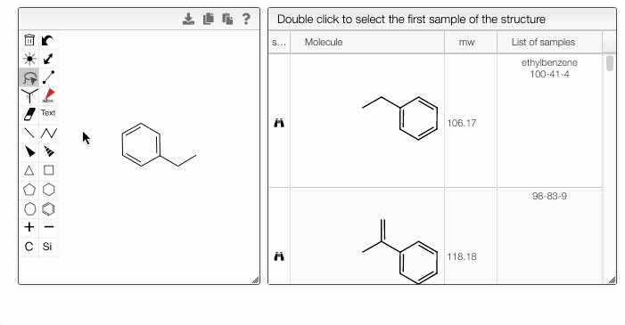
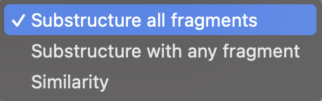

    

    Advanced Query Features
    

    

## Advanced Query features

You can fine-tune the search by specifying atomic and bond properties. These options can be accessed by hovering over the atom or bond of interest and pressing `q`. For example, you can allow certain atoms at this specific position, or you can modify the ring size.

Furthermore, you can include separate molecules in the search. This will result in structures containing both fragments with no restrictions on orientation or connectivity. One of the molecules can be selected and excluded from the search. It removes the structures completely from the search results. The excluded fragment is highlighted in pink.

In addition, you can use the dropdown selector to choose whether to search a structure that contains all the fragments, a structure that contains any fragments, or by similarity.

