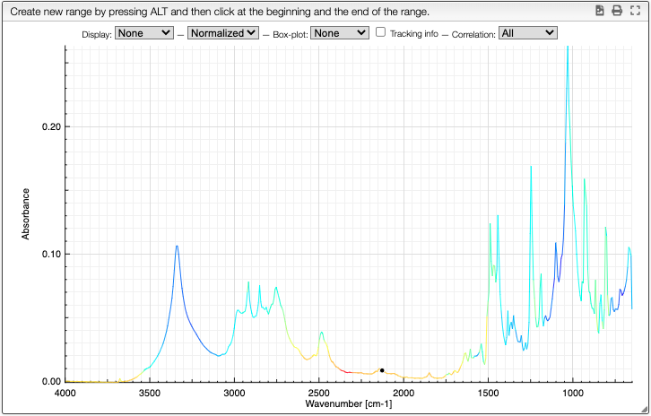

:::info

    

    Correlation of the graph.
    

    

## Correlation

The correlation is a tool used to determine the similarity between a set of curves. It is a measure of how the intensity of a peak vary with the intensity of another peak. It allows us to isololate side product for example.

<!-- If two peaks have a similar color, they are probably from the same sample. -->

:::