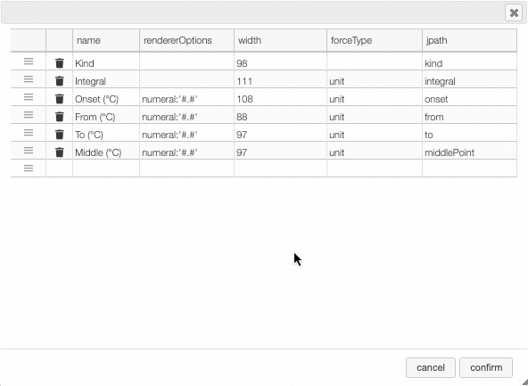
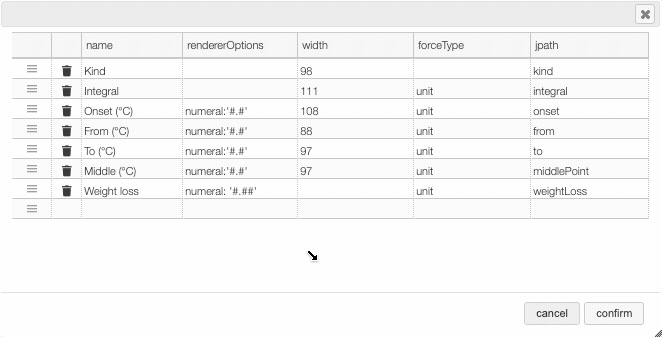

import { FaCogs } from 'react-icons/fa';

:::tip Columns customization

<details>
    <summary>
    In many tables it is possible to select which columns to display. This
    is achieved by clicking on the <FaCogs /> icon.
    </summary>
    <div>

After clicking on the <FaCogs /> icon a dialog box opens that allows to add a new column.

There are 5 parameters to fill for a new column:

- name: the column name. This will be displayed as the header to the column.
- rendererOptions: options that allows among other to format numbers. One very useful formatter is `numeral` (see after)
- width: number of pixels for the specific column. May stay empty for automatic layout.
- forceType: select how to display complex values (see later)
- jpath: where to find the information to display in the column

In order to add a new column you need to select the `jpath` using the hierarchical drop down menu.



Columns can be moved or rearranged as well.



**rendererOptions: `numeral`**

`number`,

| Value to format | rendererOptions | Result |
| --------------- | --------------- | ------ |
| 12.345678       | numeral:'#.##'  | 12.34  |
| 12.3            | numeral:'#.00'  | 12.30  |
| 0.3             | numeral:'#.0 %' | 30.0 % |

**forceType**

In the database some values are stored as an object that needs to be displayed to the user in an intuitive way.

For example the `unit` type will store in the database the value using as units `SI` (we convert the data to the units defined by the 'standard international') and specify in which units the user would like to display the data. So in the following example we are in fact storing the value -150°C by storing the value in SI (Kelvin) and specifying that the user wants to see it in °C.

```json
{
  "SI": 123.15,
  "unit": "°C"
}
```

Another example is the `valueUnits` type that will store the data in 2 different properties
(`value` and `unit`). In this case the value is stored in the specified units and there is no conversions.

```json
{
  "value": 123,
  "units": "°C"
}
```

While this way to store the data in the database is very practical it is not the way that the user would like to see his results. We have therefore the possibility to `forceType`: define how the user would like to see the results.

Other types include `mf`. This formatter allows to correctly display a molecular formula that is stored in the database as "C10H20O3". i.e. it will put the numbers in subscript (C₁₀H₂₀O₃).

</div>

</details>

:::
