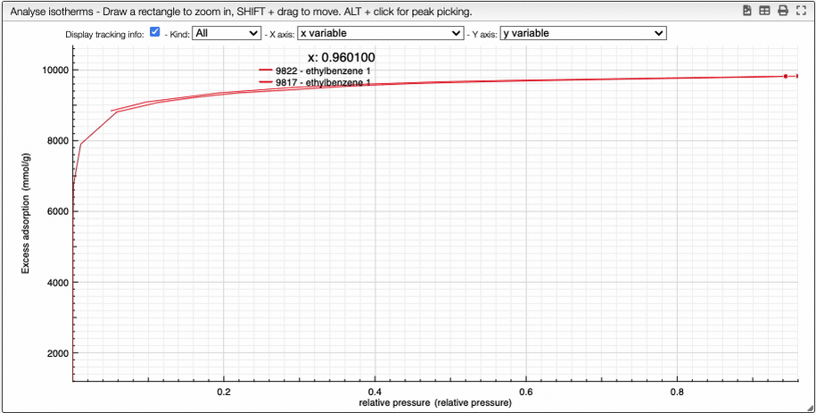

:::tip Dropdown menu for spectrum anaysis

    

    It is possible to see the dependance of one variable as a function of another.
    

    

At the top of the graph, you can see three dropdown menus. 

The first one is the choice of either all curve or either adsorption or desorption. The two other menus are the variables that you want to show as a dependence. 

