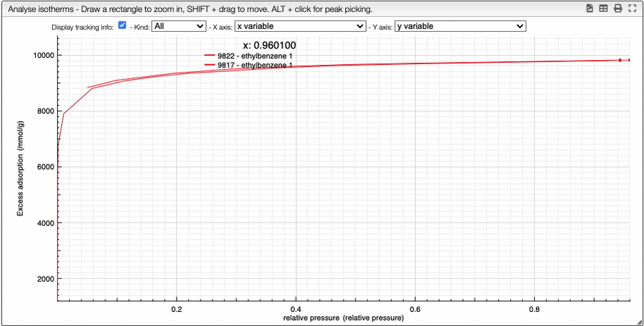

:::tip Dropdown menu for spectrum analysis

    

    It is possible to see the dependence of one variable as a function of another.
    

    

At the top of the graph, you can see three dropdown menus.

The first one lets you choose between all curves, adsorption, or desorption. The other two menus select the variables you want to display as a dependency.

You can [manipulate](../../30_structural_analysis/includes/manipulate/README.md) the graph in the same way as the IR spectrum graph.

:::