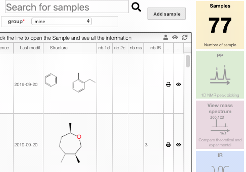

## Hide/Show sample

To hide a sample, click on the `eye` icon on the sample line.

You can display all the hidden samples by clicking on the `eye` at the top of the box. From that list you can then unhide a sample if needed.

