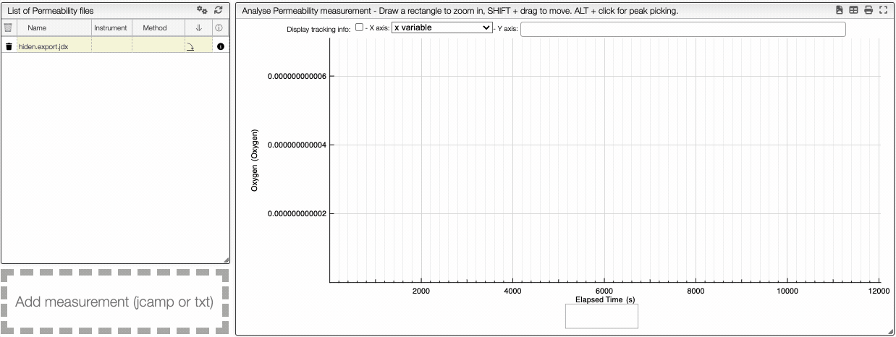

:::tip Plot multiple y variables

    

    You can superimpose multiple curve on the same plot.
    

    

This tool allows you to visualize multiple entries on the same graph. For example, the permeability of methane, nitrogen, and oxygen can be visualized simultaneously. You can select, in the `y axis` menu, the variables that you want to see. 

Every curve will be plotted with a different color and you can zoom in by selecting the area that you want, and zoom out by double clocking on the graph. Additionally, you can hide and show curves by clicking on the corresponding eye at the bottom of the graph.

:::