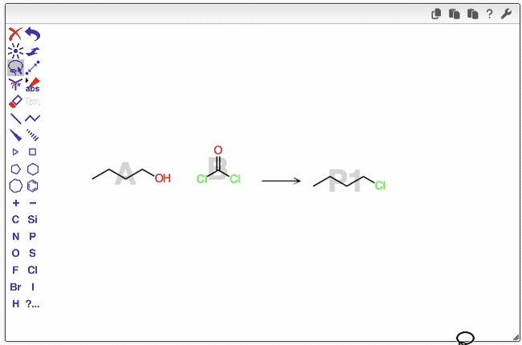

# Drawing reaction with OCL Editor

## Drawing reactants and products

The position of each molecule determines whether it is considered a **reactant** or a **product** in the reaction.

- Molecules **placed to the left** of the reaction arrow are treated as **reactants**.
- Molecules **placed to the right** of the arrow are treated as **products**.

### Using Shortcuts

Keyboard shortcuts can significantly speed up the process of drawing chemical reactions.

- **Adding carbon chains:**  
  When hovering over an atom, press a number key to add a carbon chain of that length.  
  For example, pressing <kbd>3</kbd> adds a three-carbon chain.

- **Changing atom types:**  
  To replace an atom, simply type its chemical symbol in lowercase:

  - <kbd>o</kbd> → oxygen (O)
  - <kbd>cl</kbd> → chlorine (Cl)

- **Changing bond types:**  
  When hovering over a bond, press a number key to set its bond order:
  - <kbd>1</kbd> → single bond
  - <kbd>2</kbd> → double bond
  - <kbd>3</kbd> → triple bond

## Zoom tool

The **Zoom Tool** allows you to zoom and rotate molecules. Its behavior depends on whether a molecule is selected:

- **No molecule selected:** The zoom and rotate actions are applied globally to the entire workspace.
- **One or more molecules selected:** The actions are applied only to the selected molecule(s).

### How to use

- **Zoom:** Press and move the mouse **vertically** to zoom in or out.
- **Rotate:** Press and move the mouse **horizontally** to rotate the selected molecule(s).

## Handling multipart molecules in reaction drawings

When drawing reagents or products in a chemical reaction, some compounds—such as salts—may consist of two or more distinct parts (e.g., cations and anions). Although these parts appear as separate fragments in the drawing, they represent a single chemical entity rather than multiple independent molecules.

To correctly interpret such cases, the reaction editor uses the spatial proximity of the fragments to determine whether they belong to the same molecule or should be treated as separate species. If two parts are drawn sufficiently close to each other, the editor recognizes them as a single multipart molecule; otherwise, they are considered distinct molecules.

## Copying a Reactant

In many reactions, the **product** closely resembles one of the **reactants**. To save time, you can copy a reactant and modify it to create the product, instead of drawing it from scratch.

### How to Copy a Reactant

1. **Select the molecule** using the **Lasso tool**.  
   You can do this in several ways:

   - **Double-click** on the molecule.
   - **Draw around** the molecule to select it.
   - **Hold <kbd>Alt</kbd>** and **drag a rectangular selection** around the molecule.

2. **Duplicate the selection** by holding **<kbd>Shift</kbd>** and **dragging** the molecule to the product side (right side) of the reaction arrow.

Once duplicated, you can edit the copied structure to represent the desired product.

## Mapping reactant to product atoms

Optionally, you may want to map atoms in the reactants to their corresponding atoms in the products. This can be done using the **mapping tool**.

To map atoms:

- Draw a line connecting an atom in a reactant to the corresponding atom in a product.
- OCL will then attempt to automatically map the remaining atoms.

**Color coding:**

- Atoms mapped manually by the user are displayed in **red**.
- Atoms mapped automatically by OCL are displayed in **green**.

You can modify mappings at any time:

- To delete a manual mapping, click on the red atom using the mapping tool.
- You can also manually map additional atoms as needed.

