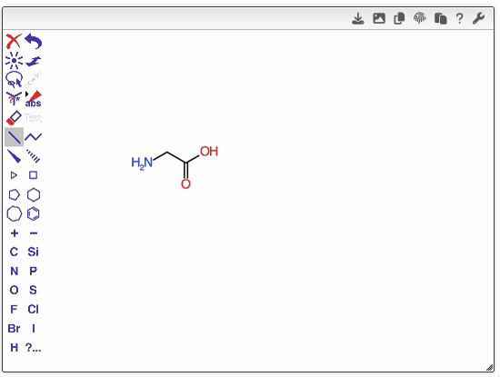

# OCL editor abbreviations

To accelerate molecule drawing, you can use any of the abbreviations listed below.  
Simply hover over an atom, type the abbreviation, and move the mouse—the corresponding structural fragment will be inserted automatically.

| Abbreviation   | Name                               |
| -------------- | ---------------------------------- |
| Acyl           | Acyl group                         |
| Alloc          | Allyloxycarbonyl                   |
| Allyl          | Allyl group                        |
| Benzyl;Bn      | Benzyl                             |
| Boc            | tert-Butoxycarbonyl                |
| BOM;BzOM       | Benzyloxymethyl                    |
| Bs             | Benzenesulfonyl                    |
| Bt             | Benzotriazolyl                     |
| Btm            | Benzothiazolylmethyl               |
| Butyl;nButyl   | n-Butyl                            |
| Benzoyl;Bz     | Benzoyl                            |
| Bzh            | Benzhydryl                         |
| Cbz            | Benzyloxycarbonyl                  |
| cButyl         | Cyclobutyl                         |
| cHeptyl        | Cycloheptyl                        |
| cHexyl         | Cyclohexyl                         |
| cOctyl         | Cyclooctyl                         |
| cPentyl        | Cyclopentyl                        |
| cPropyl        | Cyclopropyl                        |
| COOH           | Carboxylic acid                    |
| DEAE           | Diethylaminoethyl                  |
| DEIPS          | Diethylisopropylsilyl              |
| DMIPS          | Dimethylisopropylsilyl             |
| DMPM           | Dimethoxyphenylmethyl              |
| DMPS           | Dimethylphenylsilyl                |
| DMTr           | Dimethoxytrityl                    |
| DNP            | Dinitrophenyl                      |
| DNS;Dan        | Dansyl                             |
| DPIPS          | Diphenylisopropylsilyl             |
| DPTBS          | Diphenyl-tert-butylsilyl           |
| DTBMS          | Di-tert-butylmethylsilyl           |
| Ethyl          | Ethyl                              |
| Fmoc           | Fluorenylmethyloxycarbonyl         |
| iAmyl          | Isoamyl                            |
| iButyl         | Isobutyl                           |
| Im             | Imidazolyl                         |
| iPropyl        | Isopropyl                          |
| MDIPS          | Methyldiisopropylsilyl             |
| MDPS           | Methyldiphenylsilyl                |
| Methyl         | Methyl                             |
| MEM            | Methoxyethoxymethyl                |
| Mes            | Mesityl                            |
| MMTr           | Monomethoxytrityl                  |
| MOM            | Methoxymethyl                      |
| MPM;PMB        | p-Methoxybenzyl                    |
| Ms             | Methanesulfonyl                    |
| MTM            | Methylthiomethyl                   |
| mTolyl         | Meta-tolyl                         |
| N3             | Azido                              |
| nAmyl;Amyl     | n-Pentyl                           |
| neoAm          | Neopentyl                          |
| NO2,Nitro      | Nitro                              |
| Np             | Naphthyl                           |
| nPropyl;Propyl | n-Propyl                           |
| oTolyl         | Ortho-tolyl                        |
| Phenyl         | Phenyl                             |
| Pht            | Phthaloyl                          |
| Piv;Pv         | Pivaloyl                           |
| PMBM           | p-Methoxybenzoylmethyl             |
| PNB            | p-Nitrobenzyl                      |
| Poc            | Propoxycarbonyl                    |
| PPi            | Pyrophosphate                      |
| pTolyl         | Para-tolyl                         |
| sAmyl          | sec-Amyl                           |
| sButyl         | sec-Butyl                          |
| SEM            | 2-(Trimethylsilyl)ethoxymethyl     |
| SES            | β-(Trimethylsilyl)ethanesulfonyl   |
| SO3H           | Sulfonic acid                      |
| tAmyl          | tert-Amyl                          |
| TBDMS;TBS      | tert-Butyldimethylsilyl            |
| TBDPS          | tert-Butyldiphenylsilyl            |
| TBMPS          | tert-Butylmethylphenylsilyl        |
| tButyl,tBu     | tert-Butyl                         |
| TDS            | Thexyldimethylsilyl                |
| Tf             | Trifluoromethanesulfonyl (Triflyl) |
| TFA            | Trifluoroacetyl                    |
| Thexyl         | Thexyl (tert-Hexyl)                |
| THF            | Tetrahydrofuran                    |
| THP            | Tetrahydropyranyl                  |
| TIPS           | Triisopropylsilyl                  |
| TMS            | Trimethylsilyl                     |
| Tosyl;Ts       | p-Toluenesulfonyl                  |
| Troc           | 2,2,2-Trichloroethoxycarbonyl      |
| Trt            | Triphenylmethyl (Trityl)           |
| Xyl            | Xylyl                              |
