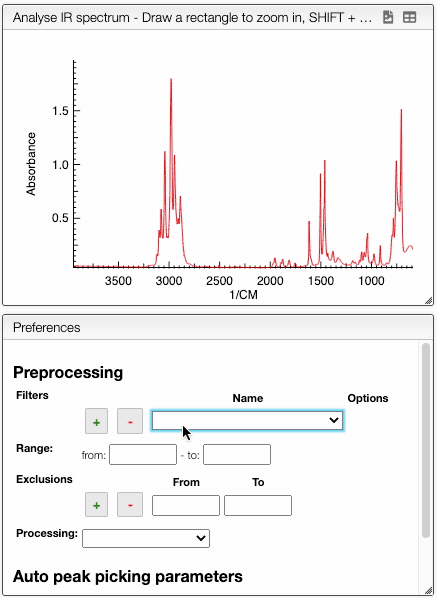

:::tip Spectrum preprocessing

    

    Apply mathematical tools to the spectra.
    

    

## Preprocessing

You can apply the following modifications to the spectra to enhance the visualization. The modifications include the following:
- `Center Mean` : subtract the mean from every variable observation in the dataset, so that the new variable's mean is centered at 0.
- `Divide by SD` : divide every variable observable in the dataset by the standard deviation yields a distribution with a standard deviation equal to 1.
- `Divide by max Y` : divide every value by the maximum y-value shifts all the y-values between 0 and 1.
- `Rescale (x to y)` : rescale the graph such that the y-values fit between specified minimum and maximum values.
- `Normalize (sum to n)` : normalize the integral under the curve so that it sums to n.
- `Multiply (value)` : multiply every y-value by a scalar.
- `Add (value)` : add a scalar to every y-value.
- `AirPLS baseline` : baseline correction using adaptive iterative reweighed penalized least squares algorithm.
- `Rolling average baseline` : 
- `Iterative polynomial baseline` : baseline correction using iterative polynomial fitting algorithm.
- `Rolling ball baseline `:
- `Rolling median baseline `:

A certain range of x-values can be selected to show only a part of the spectrum using `Range`.

Depending on the analysis, some regions should be removed using `Exclusions` in order to improve the visualization.

:::