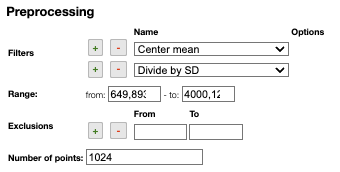

:::tip Spectrum preprocessing

    

    Apply mathematical tools to the spectra.
    

    

## Preprocessing

### Filters

You can apply the following `filters` to the spectra to enhance the visualization. The modifications include the following:

- `Center Mean` : subtract the mean from every variable observation in the dataset, so that the new variable's mean is centered at 0.
- `Center Median` : subtract the median from every variable observation in the dataset, so that the new variable's median is centered at 0`
- `Divide by SD` : divide every variable observable in the dataset by the standard deviation yields a distribution with a standard deviation equal to 1.
- `Normed`: Specify a value in the `value` field and select the type of normalization:
    - `Sum to value`: normalize the integral under the curve so that it sums to the specified value.
    - `Absolute sum to value`: normalize the integral under the curve so that the absolute sum sums to the specified value.
    - `Max to value`: normalize the maximum value to the specified value.
- `Rescale (x to y)` : rescale the graph such that the y-values fit between specified minimum and maximum values.
- `First derivative` : calculate the first derivative of the spectra.
- `Second derivative` : calculate the second derivative of the spectra.
- `Third derivative` : calculate the third derivative of the spectra.
- `Savitzky-Golay` : smooth the spectra and calculate derivatives based on the following parameters:
    - `Window`: smoothing window size, must be an odd number, greater than 5.
    - `Derivative`: derivative order.
    - `Polynomial`: the degree of the polynomial used to calculate the Savitzky-Golay.
- `AirPLS baseline` : baseline correction using adaptive iterative reweighed penalized least squares algorithm.
- `Iterative polynomial baseline` : baseline correction using iterative polynomial fitting algorithm.
- `Rolling average baseline` : baseline correction using a rolling average.
- `Rolling median baseline` : baseline correction using a rolling median.
- `Rolling ball baseline` : baseline correction using a rolling ball.
- `Ensure growing X values`: ensure that the x-values are in increasing order.
- `Function on X` : apply a function to the x-values. For example, `log(x)`.
- `Function on Y` : apply a function to the y-values. For example, `log10(y+1)`.
- `Calibrate X` : calibrate the x-values with the parameters `from`, `to`, `nbPeak` and `targetX`.
- `Pareto normalization` : Pareto scaling, which uses the square root of standard deviation as the scaling factor, circumvents the amplification of noise by retaining a small portion of magnitude information. [10.1016/j.molstruc.2007.12.026](https://dx.doi.org/10.1016/j.molstruc.2007.12.026)

One classical preprocessing algorithm is [Standard Normal Variate (SNV)](http://wiki.eigenvector.com/index.php?title=Advanced_Preprocessing:_Sample_Normalization#SNV_.28Standard_Normal_Variate.29). This preprocessing can be achieved by selecting the 2 options `Center mean` and `Divide by SD`.

### Selecting the range

A certain range of x-values can be selected to show only a part of the spectrum using `Range`.

### Exclusions

Depending on the analysis, some regions should be removed using `Exclusions` in order to improve the visualization.

### Number of points

`Number of points` can be changed to reduce the number of points in the spectra.

:::