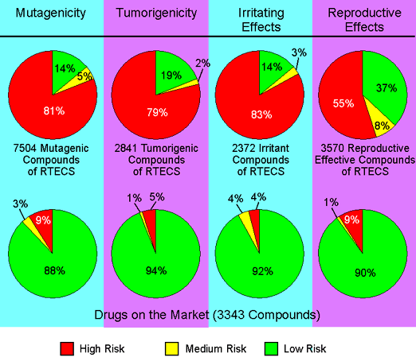
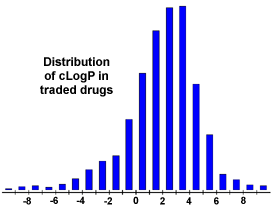
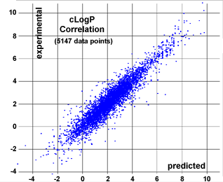
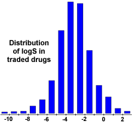
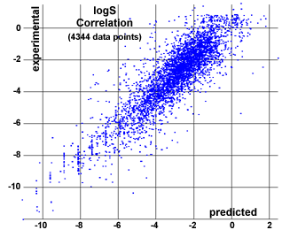
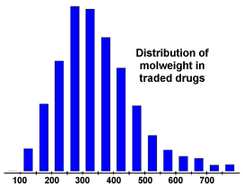
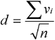
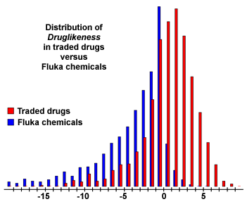
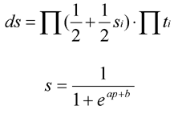

# Properties prediction

## Toxicity risk assessment 

While drawing a structure the toxicity risk predictor will start looking for potential toxicity risks as long as the currently drawn structure is a valid chemical entity. Toxicity risk alerts are an indication that the drawn structure may be harmful concerning the risk category specified. However, risk alerts are by no means meant to be a fully reliable toxicity prediction. Nor should be concluded from the absence of risk alerts that a particular substance is completely free of any toxic effect.

In order to assess the toxicity prediction’s reliability we ran a set of toxic compounds and a set of presumably non-toxic compounds through the prediction. The diagram below shows the results obtained by predicting all available structures of four subsets of the RTECS database. E.g. all structures known to be mutagenic were run through the mutagenicity assessment. 86 % of these structures where found to bear a high or medium risk of being mutagenic. As a controlset served a collection of traded drugs of which the mutagenicity risk assessment revealed only 12 % of potentially harmful compounds.

The prediction process relies on a precomputed set of structural fragment that give rise to toxicity alerts in case they are encountered in the structure currently drawn. These fragment lists were created by rigorously shreddering all compounds of the RTECS database known to be active in a certain toxicity class (e.g. mutagenicity). During the shreddering any molecule was first cut at every rotatable bonds leading to a set of core fragments. These in turn were used to reconstruct all possible bigger fragments being a substructure of the original molecule. Afterwards, a substructure search process determined the occurence frequency of any fragment (core and constructed fragments) within all compounds of that toxicity class. It also determined these fragment’s frequencies within the structures of more than 3000 traded drugs. Based on the assumption that traded drugs are largely free of toxic effects, any fragment was considered a risk factor if it occured often as substructure of harmful compounds but never or rarely in traded drugs.

## cLogP calculation

The logP value of a compound, which is the logarithm of its partition coefficient between n-octanol and water log(coctanol/cwater), is a well established measure of the compound’s hydrophilicity. Low hydrophilicities and therefore high logP values cause poor absorption or permeation. It has been shown for compounds to have a reasonable propability of being well absorbt their logP value must not be greater than 5.0. The distribution of calculated logP values of more than 3000 drugs on the market underlines this fact (see diagram).

Our in-house logP calculation method is implemented as increment system adding contributions of every atom based on its atom type. Alltogether the cLogP predicting engine distinguishes 368 atom types which are composed of various properties of the atom itself (atomic no and ring membership) as its direct neighbours (bond type, aromaticity state and encoded atomic no). More than 5000 compounds with experimentally determined logP values were used as training set to optimize the 369 contribution values associated with the atom types. The correlation plot (see diagram) shows calculated versus experimentally determined logP values of an independent test set of more than 5000 compounds being different from the training set.

## logS calculation

The aqueous solubility of a compound significantly affects its absorption and distribution characteristics. Typically, a low solubility goes along with a bad absorption and therefore the general aim is to avoid poorly soluble compounds. Our estimated logS value is a unit stripped logarithm (base 10) of the solubility measured in mol/liter.

In the following diagram you can see that more than 80% of the drugs on the market have a (estimated) logS value greater than -4.

Similar to our in-house logP calculation we assess the solubility via an increment system by adding atom contributions depending on their atom types. The atom types employed here differ slightly from the ones used for the cLogP estimation in that respect that the ring membership is not looked at. Still there are 271 distinguishable atom types describing the atom and its near surrounding. More than 2000 compounds with experimentally determined solubility values (25 degrees, pH=7.5) were used as training set to optimize the contribution values associated with the atom types. The correlation plot on the right shows calculated versus experimentally determined logS. You can see that the precision of the logS estimation is worse than the one for logP. This is because the solubility of a substance depends to a certain extend on how effectively the molecules are arranged in the crystall and these topological aspects cannot be predicted via atom types nor substructure fragments.

## Molecular weight

Optimizing compounds for high activity on a biological target almost often goes along with increased molecular weights. However, compounds with higher weights are less likely to be absorbed and therefore to ever reach the place of action. Thus, trying to keep molecular weights as low as possible should be the desire of every drug forger.

The diagram shows that more than 80 % of all traded drugs have a molecular weight below 450.

## Fragment based druglikeness 

There are many approaches around that assess a compound’s druglikeness partially based on topological descriptors, fingerprints of MDL struture keys or other properties as cLogP and molecular weights. Our approach is based on a list of about 5300 distinct substructure fragments with associated druglikeness scores. The druglikeness is calculated with the following equation summing up score values of those fragments that are present in the molecule under investigation:

The fragmentlist was created by shreddering 3300 traded drugs as well as 15000 commercially available chemicals (Fluka) yielding a complete list of all available fragments. As a restriction the shredder considered only rotatable bonds as cuttable. In addition the substitution modes of all fragment atoms were retained, i.e. fragment atoms that hadn’t been further subtituted in the original compounds were marked as such and atoms being part of a bond that was cut were marked as carrying a further substituent. This way fragment substitution patterns are included in the fragments.

The occurence frequency of every one of the fragments was determined within the collection of traded drugs and within the supposedly non-drug-like collection of Fluka compounds. All fragments with an overall frequency above a certain threshold were inverse clustered in order to remove highly redundant fragments. For the remaining fragments the druglikeness score was determined as the logarithm of the quotent of frequencies in traded drugs versus Fluka chemicals.

The subsequent diagram shows the distribution of druglikeness values calculated from 15000 Fluka compounds and from 3300 traded drugs. It shows that about 80% of the drugs have a positive druglikeness value whereas the big majority of Fluka chemicals accounts for the negative values.

Thus, try to keep your compounds in the positive range…

A positive value states that your molecule contains predominatly fragments which are frequently present in commercial drugs. What it doesn’t necessarily mean, though, is that these fragments are well ballanced concerning other properties. For instance, a molecule may be composed of drug-like, but lipophilic fragments only. This molecule will have a high druglikeness score although it wouldn’t really qualify for being a drug because of its high lipophilicity.

## Drug score

The drug score combines druglikeness, cLogP, logS, molecular weight and toxicity risks in one handy value than may be used to judge the compound’s overall potential to qualify for a drug. This value is calculated by multiplying contributions of the individual properties with the first equation:

ds is the drug score. si are the contributions calculated directly from of cLogP, logS, molweight and druglikeness (pi) via the second equation which describes a spline curve. Parameters a and b are (1, -5), (1, 5), (0.012, -6) and (1, 0) for cLogP, logS, molweight and druglikeness, respectively. ti are the contributions taken from the 4 toxicity risk types. The ti values are 1.0, 0.8 and 0.6 for no risk, medium risk and high risk, respectively.