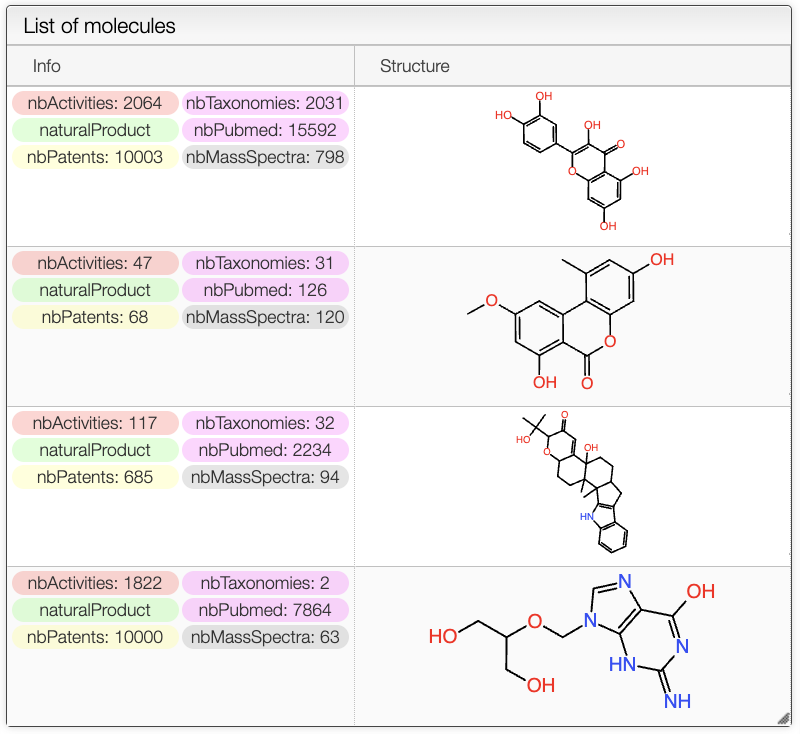
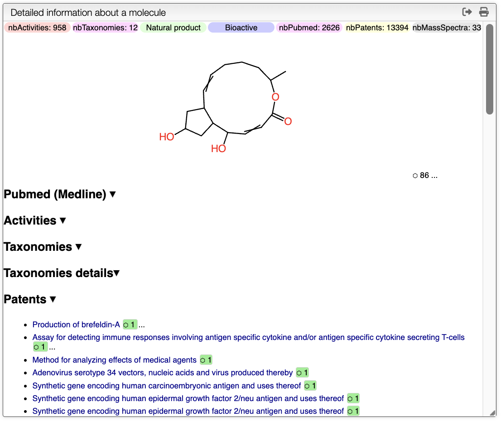

## Search Results

The results of the search are displayed in a table. The table includes the structure of the compounds as well as tags such as the number of taxonomies, activities, patents, mass spectra... It also shows if the compounds is a natural product or not.

## Compound Page

On the `Detail information` panel, you can find more information about the compound. On the top of the panel, there are the tags associated with the number of mass spectra, number of patents... Below, there is the structure of the compound without stereochemistry, the number on the right indicates the number of stereoisomers found in the database. By clicking on it, you will find all the structures as well as where it comes from. 

**Pubmed (Medline)**:
In this section, you will find all the publications associated with the compound. By clicking on the title of the publication, you will be redirected to the Pubmed page. The number on the right of each title indicates the number of times that this compounds has been described in the publication. A green color indicates that the publication can be interesting. This allows the user to quickly find the most relevant publications. The three dots next to the number allow the user to see the abstract of the publication. The abstract includes the mesh terms.

**Activities**:
Activities show additional details on the activities of the compound. It includes `Superkingdom`, `Kingdom`, `Phylum`, `Class`, `Order`, `Family`, `Genus`,	`Species`.

**Taxonomies details**:
Taxonomies section shows the taxonomy tree of the compound. The depth of the tree can be controlled in the search panel, described above.

**Patents**:
Similar to the Pubmed section, this section shows the patents associated with the compound. By clicking on the title of the patent, you will be redirected to the associated page. Again, the number on the right indicates the number of times that this compounds has been described in the patent. The three dots next to the number allow the user to see the abstract of the patent.

Obviously, all sections can be expanded and collapsed by clicking on the arrow on the right.
