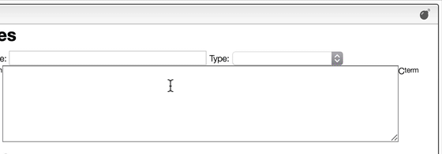

## Explode nucleic and peptidic sequences

Most of the time you enter a peptidic or nucleic sequence as one letters code.

However, it may happen that you have the terminal chain modified like in the case of a small tripeptide `AAL` that would have on the N-term a Boc and on the C-term a NH2.

In order to enter correctly you should first enter the sequence `AAL` and then explode the sequence. You may then change the N-term and C-term.

