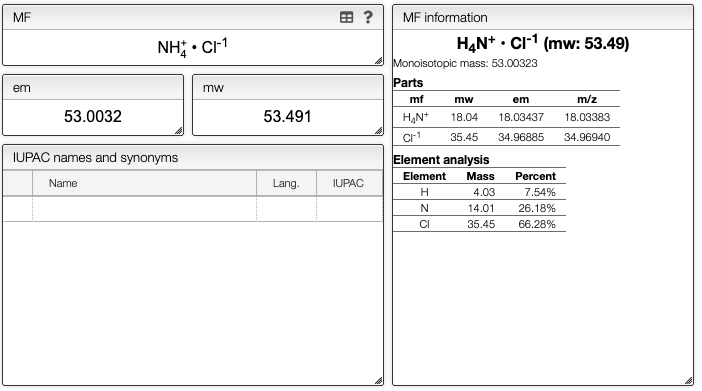

## Information about MF

While the molecular formula is calculated automatically from the chemical structure it is sometimes useful to directly edit the molecular formula.

When you enter the molecular formula you may use the '.' to separate salt and also
add charges in each part of the molecule.

You will see an information about the molecular weight and monoisotopic mass of all
the parts of the molecule in the `Molecular formula information box`

