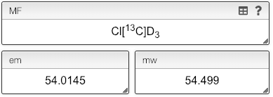

## Molecular formula: isotopes

While the molecular formula is calculated automatically from the chemical structure it is sometimes useful to directly edit the molecular formula.

Isotopes have to be entered between square brackets like `[13C]`. There is one exception, `D` that is a synonym of `[2H]`.

There is also the possibility to enter non-natural isotopic ratio. In this case the ratio between all the stable isotopes will be placed between curly brackets and separated by a comma. This is, if you have a molecule with 10 carbons having 20% [12C] and 80% [13C] you will enter `C{20,80}10`.
