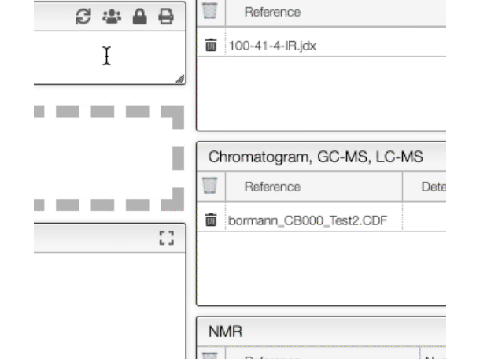

## Access rights

You have the possibility to view and edit the rights that are associated with an entry by clicking on the `users` icon.

From there you can check all the users / groups that currently have access to the selected entry as well as all the groups you belong to.

From there you can add / remove groups access as well as specify a new group or a new email address that you would like to add.

