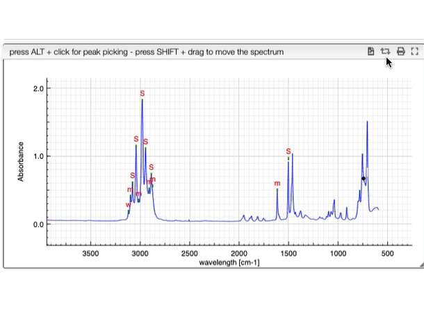

## Switch between absorbance and transmittance

When loading a spectrum the application is aware it was acquired in
transmittance or absorbance mode.

If you want to switch between the 2 you may click on the toggle icon. The application
will remember your preferred mode for the next time.

