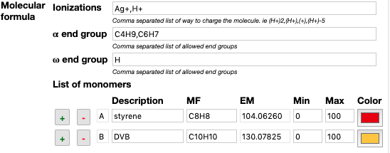
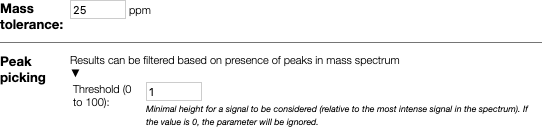
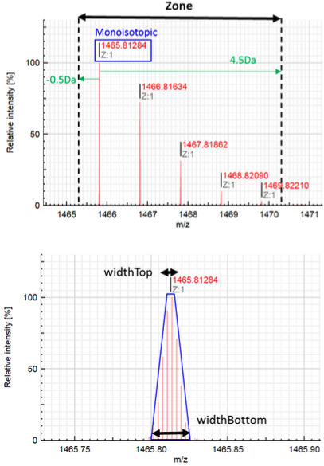
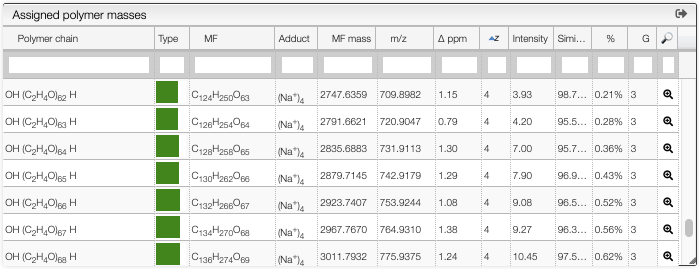
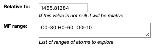
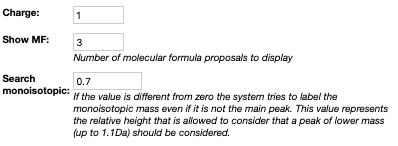
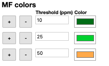
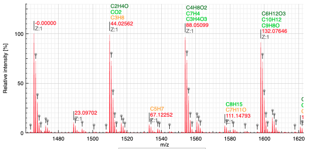

## MSPolyCalc: advanced polymer mass analysis

### Your data are safe !

All the calculations applied during data treatment are performed locally in the browser, with no data transferred between servers. Data handling is therefore done safely and securely, being compatible with confidential data.

You can therefore use confidential information without any risks.

### Licence

This application is provided under the [MIT licence](https://github.com/cheminfo/mspolycalc/blob/master/LICENSE).

### Quick start

#### Load your data

- Drag and drop your spectrum in “.txt” format or copy / paste (CTRL+V) your data in the box.
- Your spectrum appears in the Mass spectra window in red.

#### Targeted analysis

##### 1. Define your theoretical polymer distribution

In the “Analysis preferences” window, specify the criteria required to generate theoretical polymer distributions.

- Ionization: e.g. Na+ or (H+)3 for multi charged.
- End-groups: e.g. H, C4H9
- Monomer MF: e.g. C8H8

It is possible to include multiple criteria with the use of comas “,”.

If is also possible to define an unlimited number of monomers that compose the polymer. Color will help to identify the composition after analysis.

##### 2. Experimental data treatment

The resulting theoretical peak list (calculated in background) will be compared with your experimental data, based on the criteria in the “Peak picking” subsection and the mass tolerance

- threshold (minimum peak intensity considered)
- mass tolerance within which peaks are assigned

##### 3. Isotopic pattern Similarity Tool

MSPolyCalc can help users evaluate matching scores for polymer distribution assignment. Peaks can be assigned based on monoisotopic masses only (similarity = 0 - function is ignored) or based on a full isotopic pattern matching evaluation (similarity > 0). In that case, users must define the way to compare isotopic patterns, in particular the range of masses.
It is important to fill up the function “Zone” (in Da) while the function “Width” is optional, and more addressed to advanced users.

##### 4. Click on `Assign`

After clicking on assign the system will try to match the possible molecular formula to the experimental peaks and display the results.

The table contains the following information:

- `Polymer chain`: the semi developed molecular formula of the polymer chain
- `Type`: the monomer composition of each chain is described through a color representation
- `MF`: the molecular formula corresponding to the non ionized polymer
- `Adduct`: the ion that was added to obtain the observed mass (based on the `ionizations` preference)
- `MF mass`: the theoretical monoisotopic mass corresponding the non ionized polymer
- `m/z`: the theoretical monoisotopic mass of the corresponding ion
- `Δ ppm`: difference between theoretical and experimental mass
- `z`: charge state of the ion
- `Intensity`: intensity of the peak identified as monoisotopic, relative to the base peak
- `Similarity`: percentage of similarity for the isotopic distribution
- `%`: sum of the assigned peaks areas (all peaks included in the defined Zone) with respect to the sum of all detected peaks areas (experimental peak picking)
- `G`: number of ionizations for a given polymer chain (same polymer with different adducts)

#### Untargeted analysis

When the composition of the polymer is unknown, MSPolyCalc is able to find the difference in mass between a reference peak as well as possible molecular formula.

In order to define the reference peak simply click on the label over the peak. The value of the label will be set in the preferences.

The system will explore all the possible molecular formula defined in MF range. You may put there any element and any range. Ranges are defined with a `-` and for readability it is advised to separate the elements by a space.

In order to search the corresponding molecular formula it is required to specify the charge of the targeted peak. This should be automatically set when you click on the label.

`Show MF` defines the number of best matching molecular formula that should be displayed.

`Search monoisotopic` In an isotopic distribution, the peak of the highest intensity is not always the monoisotopic peak. Thus, this function tries to look for a monoisotopic peak that would be on the left (lower mass) of the highest peak. If there is a peak of lower mass distant from less than 1u, and that has a ratio over the specified value it is considered as the monoisotopic mass.

Matching molecular formula are colored based on the error (in ppm) as specified using the following table:

The result of the analysis displays the relative mass (on the m/z scale) as well as the list of best matching molecular formula and the charge.

