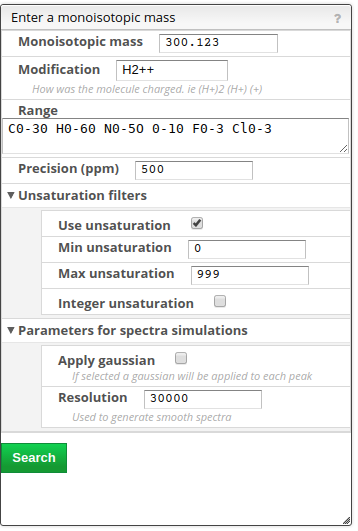

# MF from monoisotopic mass

## Molecular formula from monoisotopic mass

This tool allows finding possible molecular formula for a specific observed monoisotopic mass. When the elements are part of H, C, O, N, F, Cl, Br, I, Si, P and O the monoisotopic mass corresponds to the peak of the isotopic distribution that has the lowest mass.

However, by mass we don’t observe a monoisotopic mass directly but always a charged form. The molecule may be charged positively, negatively, multicharged or also modified by the addition of protons or other charged entities.

This tool will consider the mass of the electron and the number of charge of the molecule.

### Options

<table>
  <thead>
    <tr>
      <th style="text-align:left">
        
      </th>
      <th style="text-align:left">
        <ul>
          <li>Monoisotopic mass: the target observed monoisotopic mass</li>
          <li>Modification: what was added or remove in order to observe the monoisotopic
            mass ? For example:
            <ul>
              <li>(H+)2 : adding 2 protons</li>
              <li>(NH4+)</li>
              <li>(--): adding 2 electrons</li>
            </ul>
          </li>
          <li>Range: What are the range of atoms that you be explored. All the stable
            isotopes may be considered and a range is specified as Atomfrom-to. For
            example:
            <ul>
              <li>C2-20 H2-40 : all moleculear formula having between 2 and 20 carbons and
                2 and 40 hydrogens</li>
            </ul>
          </li>
          <li>Precision (ppm): The precision of the spectrometer. Only the molecular
            formula that fits in the precision will be displayed.</li>
          <li>Unsaturation filters for the observed MF
            <ul>
              <li>Use unsaturation: if true we filter the molecular formula based on unsaturation</li>
              <li>Min unsaturation: minimal number of unsaturations. Normally an unsaturation
                should never be negative</li>
              <li>Max unsaturation: Maximal number of unsaturation.</li>
              <li>Integer unsaturation: if the modification is (+) and it is not a radical
                the unsaturation must be an integer</li>
            </ul>
          </li>
          <li>Parameters for spectra simulations: by default we calculate the mass spectrum
            with a peak width of 0.
            <ul>
              <li>Apply gaussian: peaks will be calculate as gaussians</li>
              <li>Resolution: resolution of the spectrometer that will allow to calculate
                the FWHM (Full Width Half Maximum) of the gaussians.</li>
            </ul>
          </li>
        </ul>
      </th>
    </tr>
  </thead>
  <tbody></tbody>
</table>## Pubchem candidates

Using the button ‘Pubchem candidates’ you are able to list all the possible molecular formula that yields to the desired monoisotopic mass with the defined precision.

Couple of points to note:

- PubChem does not provide the isotope information in the molecular formula
- PubChem does not provide the different parts of the molecule in the molecular formula
- PubChem is not consistent with the monoisotopic mass they list on their website

Therefore we have recalculated the molecular formula, monoisotopic mass, charge and molecular weight from the provided molfile. This allows us to have very accurate monoisotopic mass that also deals with isotopes.

Please note that for the calculation of the monoisotopic mass we didn’t consider the charge !

NB: only stable isotopes are considered !
