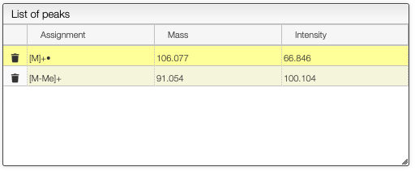
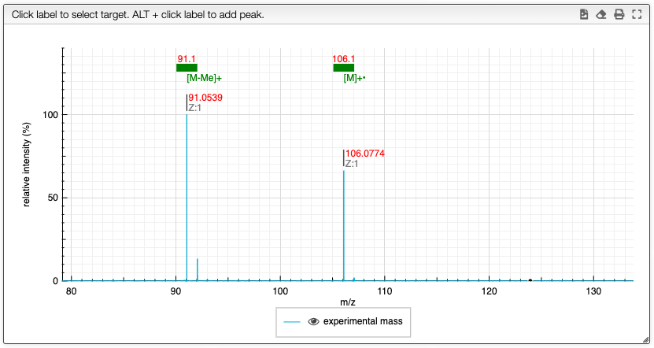

## Assign mass spectrum

It is possible to assign mass spectra by ALT + click on a peak mass value. If the value does
not appear you need to zoom before on the peak.

In the table you can double-click in the `assignment` column to enter the corresponding value.

You will obtain a spectrum with annotations on the top:

