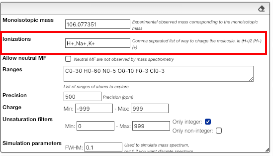

## Ionizations

In order to observe a neutral molecule the mass spectrometer will charge it using different techniques. This may involve adding protons, remove electrons, etc.

You can also observe charged molecules resulting of the addition of Na+, K+, etc.

In order to evaluate all the possibilities you must enter in the 'ionizations' field a comma separated list of all the allowed ionizations.

You may as well specify multiple charges. Here are some examples of allowed patterns:

- H+ (addition a proton)
- H+, Na+, K+ (either a proton, sodium cation or potassium cation)
- H+, (H+)2, (H+)3 (addition of one, two or three protons)
- (H+)-1, (H+)-2, (H+)-3 (removal of one, two or three protons)

