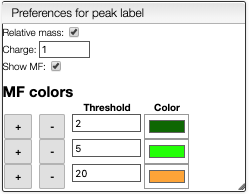
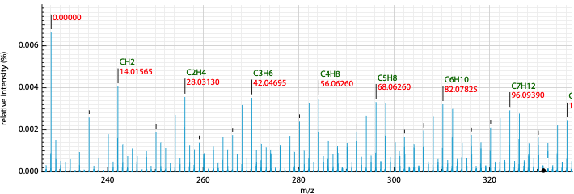

## Relative mass and MF determination

This view displays normally the mass of the peaks, but it is also possible to display relative mass to a specific peak.

1. Click on a peak to change the `Monoisotopic mass` value
2. Click on the checkbox `Relative mass` on the top right

It is also possible to display possible molecular formulas for the relative mass. Those are calculating using the following criteria:

- allowed atoms are based on the `Ranges`
- only neutral loss are considered
- the charge of the entity loosing this neutral fragment is defined in `Charge`, by default 1
- you should select `Show MF` in order to annotate the peaks with the corresponding MF

It is also possible to define the color of the MF annotation depending on the precision. By default, if no MF is found under a precision of 20ppm no MF is displayed.

