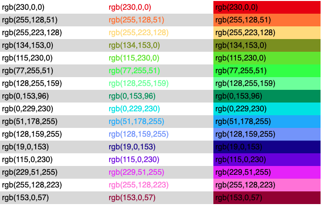

## Using distinct colors

We have exposed a library that allows from a script to get distinct colors.

```js
let colors = Color.getDistinctColorsAsString(16);
data.report.colors = colors;
```

You can then format tables either to change the font color or the background color:

```html
<style>
  #report {
    font-family: sans-serif;
  }
  #report th,
  #report td {
    text-align: left;
    padding: 4px;
  }
  #report tr:nth-child(even) {
    background: #ddd;
  }
  #report tr:nth-child(odd) {
    background: #fff;
  }
  #report table {
    border: 0;
    border-collapse: collapse;
    width: 100%;
  }
</style>
<div id="report">
  <table>
    
    <tr>
      <td>{{color}}</td>
      <td style="color: {{color}}">{{color}}</td>
      <td style="background-color: {{color}}">{{color}}</td>
    </tr>
    
  </table>
</div>
```


