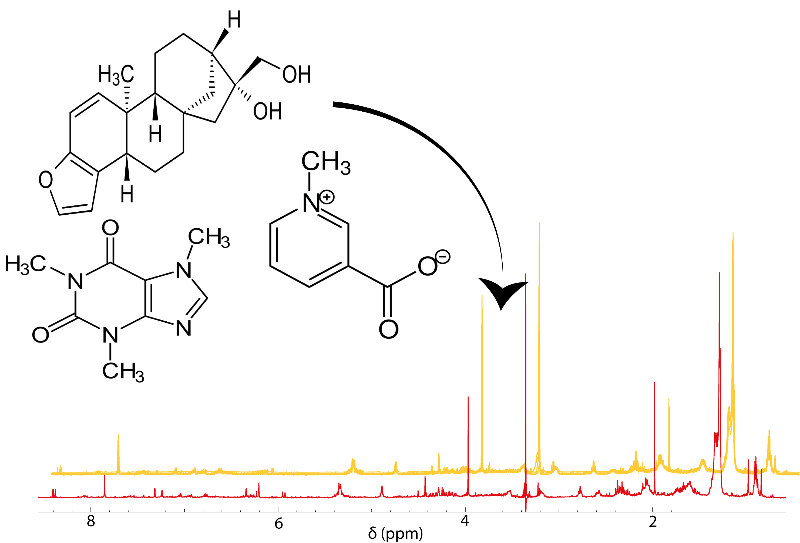

# NMR dataset generator

This tool is designed with the main purpose of building artificial 1H NMR data sets from your own library of molecules. This could be useful to help with identification of metabolites or in the process of developing new statistical methods. The current version allows to generate a dataset from any file in .mol or .sdf format, define the number of categories and the population for each of them, attribute a concentration distribution (or default ones) to each molecule and add some artificial noise.

