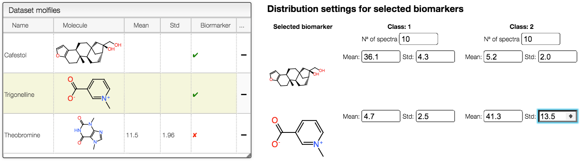

## Define biomarkers

To select the biomarkers, i.e., molecules with a different distribution among the defined populations, double-click on the red cross in the table on the left. This will enable you to choose the number of spectra for each class that should be generated, and to set the mean and the standard deviation for each biomarker.

