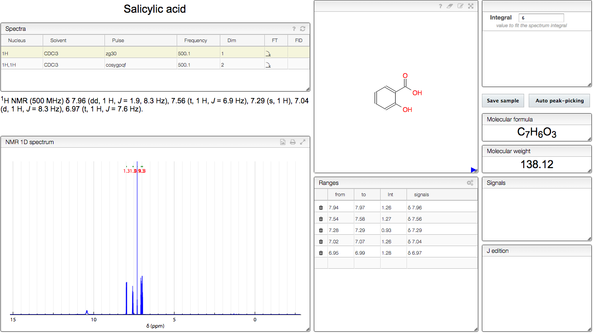

# Peak picking and assignment

As you open the tab the table will be filled with the Spectra available for the selected sample. Select one line to plot the corresponding NMR spectrum. We recommend you start from our Auto peak-picking. You will see the detected Ranges and their integrals just to the right of the spectrum. Select a range to see a list of the associated Signals with their multiplicities and coupling constants. Adjust the table values according to your own criterion. Use the J edition table to modify the multiplicity and coupling constants. A publication-ready report of your peak picking is automatically generated below the Spectra table. Don’t forget to Save your changes.

Integration is automatically computed upon defining the corresponding range and cannot be edited manually. You may edit the Pub int column on the Ranges table to fine-tune the integral values in the report.

To assign a peak select a range in the Ranges table and then select the nuclei to be assigned in the Structure. An icon appears in the last column of the Ranges table showing that the peak has been assigned; click that icon to remove the assignment. Assigned nuclei are highlighted whenever the corresponding peak is selected in the NMR spectrum.
