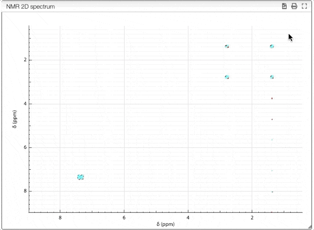

## Vertical scaling of 2D spectra

It is possible to vertical scale 2D spectra with the scroll wheel.

By default, positive and negative spectra are scaled simultaneously when the scroll wheel is scrolled.

If you want to scale the negative part independently of the positive part you should scroll the wheel while maintaining SHIFT pressed.

