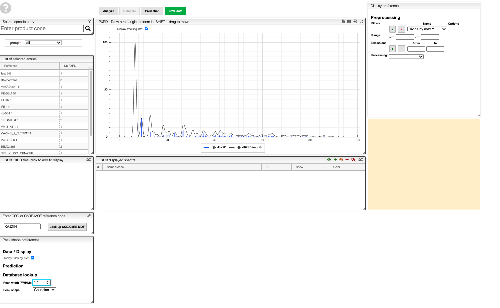

# PXRD pattern database lookup

In the ELN you can find a text field in which you can enter a [COD](http://www.crystallography.net/cod/) or [CoRE-MOF](https://zenodo.org/record/3677685#.XzqXbZMzY8M) reference code to obtain the predicted pattern for a structure from those databases.

For example, if you enter [`KAJZIH`](https://www.ccdc.cam.ac.uk/structures/Search?Ccdcid=KAJZIH&DatabaseToSearch=Published) you will find the predicted powder pattern for Cu(I/II)-BTC. As in the other views, you can also generate a smoothed version.

