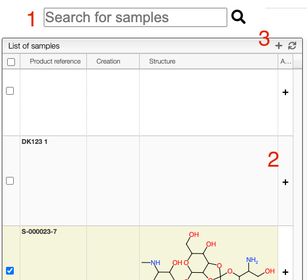
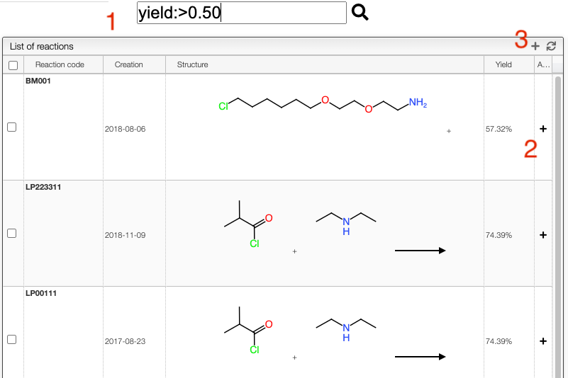
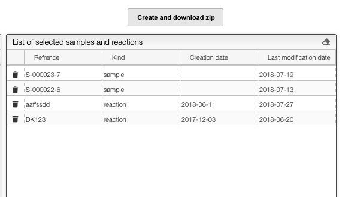

## Download data as a ZIP file

This application allows downloading as a zip a set of samples and ELN entries.

On the left of the screen you are able to search and select samples

1. You can enter a keyword, product code, meta information, etc. to search for you samples
2. By clicking on the ⨁ icon you can add a specific sample
3. You can also select many samples (or all of them) and click on the ⨁ icon from the toolbar

The middle of the screen allows selecting ELN entries:

1. You can enter an ELN entry code, yield, reagent or product code to search for you ELN entries
2. By clicking on the ⨁ icon you can add a specific ELN entry
3. You can also select many entries (or all of them) and click on the ⨁ icon from the toolbar

Finally, to export all your data simply click on the `Create and download zip` button.

