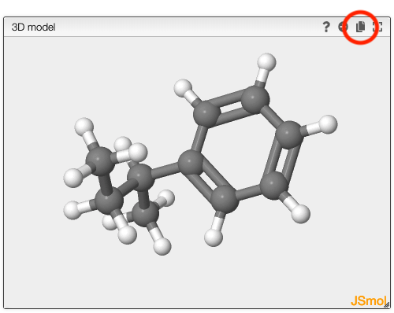
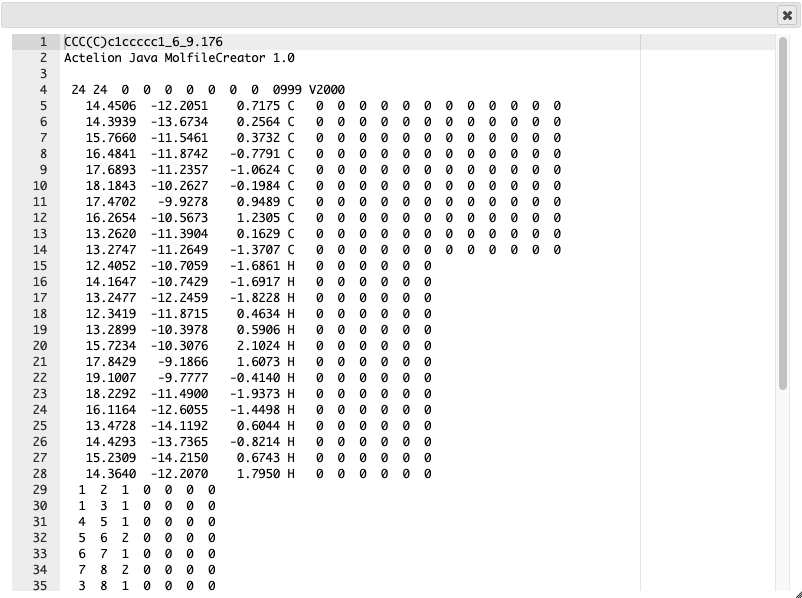

## Copy model as molfile

If you would like to copy the resulting model you can generate a molfile by clicking on the copy icon in the model window.

A window will open that contains the molfile.

