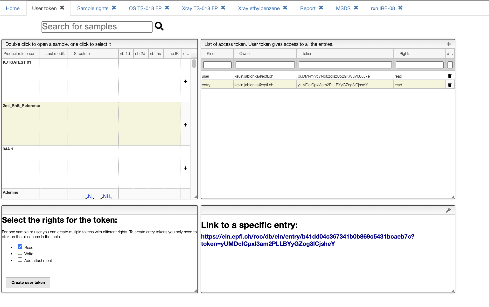
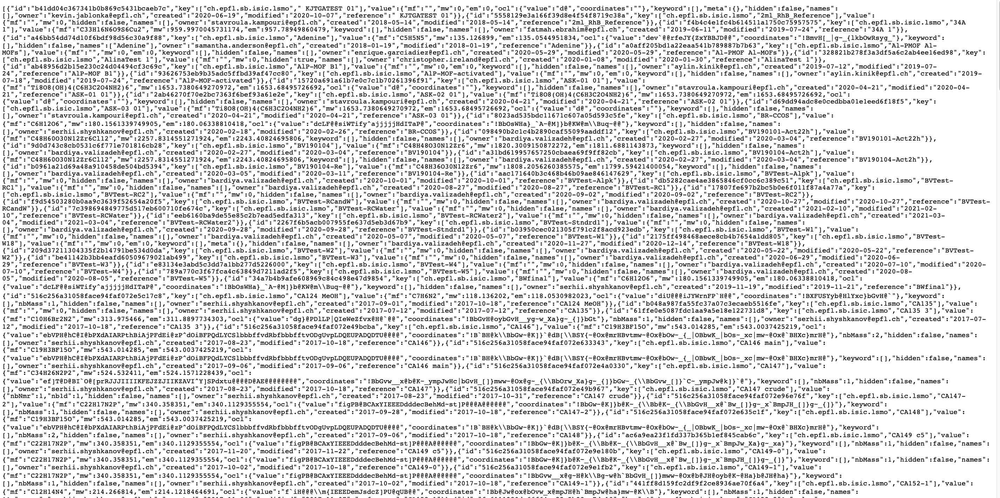

## Creating access tokens

Access tokens can be used as alternative authentication mechanism to access certain documents of the ELN.
Token can be created for samples and entries and with different rights.

Especially useful are tokens when you want to programmatically access certain documents of the ELN. You can do so, for example, using our [cheminfopy](https://github.com/cheminfo-py/cheminfopy) library. But you can also use tokens to give collaborators a URL with which they can
access certain documents of the ELN, e.g., to see one specific sample. This view allows creating bespoke tokens.

For all tokens, the view will display some useful URLs in the bottom right.

### Creating user token

To create a user token you only need to click the button "create user token" in the bottom left box.
A new token of type `user` will then show up in the top right table. With user tokens you can access all entries for a user.

For example, clicking the link under the heading "List all accessible entries:" will lead you to a page which you can find a JSON document will all entries.

### Creating entry tokens

In some cases, you only want to allow access to specific samples. In this case, you can select the samples of interest can then create tokens for them by clicking the "+" icon.

## Deleting tokens

You can delete any token by just clicking at the trash can icon.
